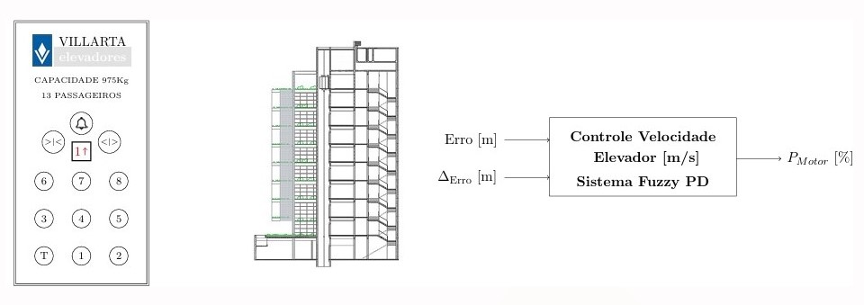

# Controle Fuzzy para Elevador



## Introdução

Este projeto implementa um sistema de controle fuzzy para um elevador. A lógica fuzzy é utilizada para tomar decisões baseadas em regras vagas e ambíguas, permitindo um controle mais eficiente e adaptativo do elevador em comparação aos métodos tradicionais.

## Estrutura do Projeto

- `Assets/backgroundReadme.jpg`: Imagem de fundo para o README.
- `Fuzzy.ipynb`: Notebook principal que contém a implementação do sistema de controle fuzzy.
- `requirements.txt`: Arquivo que contém todas as dependências necessárias para executar o projeto.

## Como Executar o Projeto

Siga as etapas abaixo para configurar e executar o projeto:

1. **Clone o repositório:**
   ```sh
   git clone https://github.com/seu_usuario/seu_projeto.git
   cd seu_projeto
   ```

2. **Crie um ambiente virtual (opcional, mas recomendado):**
   ```sh
   python -m venv venv
   source venv/bin/activate  # No Windows, use `venv\Scripts\activate`
   ```

3. **Instale as dependências:**
   ```sh
   pip install -r requirements.txt
   ```

4. **Execute o notebook:**
   Abra o arquivo `Fuzzy.ipynb` em um editor de notebooks, como o Jupyter Notebook ou o Jupyter Lab, e execute todas as células para ver o sistema de controle fuzzy em ação.

## Conclusão

Este projeto demonstra como a lógica fuzzy pode ser aplicada para controlar um elevador, oferecendo uma solução mais flexível e eficiente em comparação aos métodos de controle tradicionais. Sinta-se à vontade para explorar o código, modificar as regras fuzzy e adaptar o sistema para outras aplicações.

## Integrantes

- Matheus Camara Carvalho
- Gabriel Gemelle
- Igor da Silva Villamarim

## Contribuição

Se você quiser contribuir com este projeto, sinta-se à vontade para fazer um fork do repositório, criar uma nova branch e enviar um pull request com suas melhorias.

## Contato

Para dúvidas ou sugestões, entre em contato através do e-mail [seu_email@dominio.com](mailto:seu_email@dominio.com).

---

**Autores:** Matheus Camara Carvalho, Gabriel Gemelle, Igor da Silva Villamarim  
**Data:** Junho de 2024
